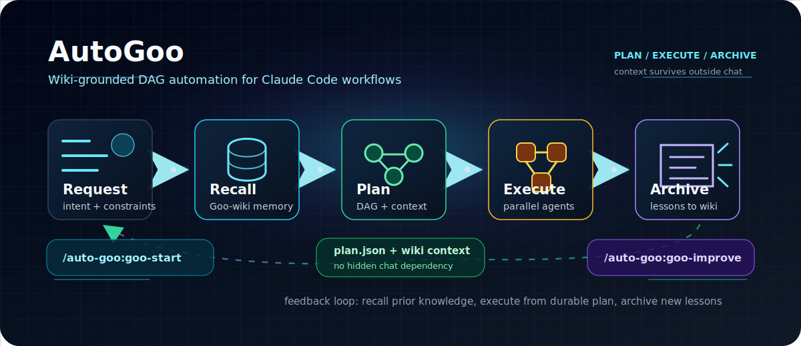

# AutoGoo

[](#release)
[](LICENSE)
[](#installation)
[](#release)

AutoGoo is a Claude Code plugin that turns an open-ended request into a traceable,
wiki-grounded multi-agent workflow: reuse prior project knowledge from Goo-wiki,
plan the task as a DAG, execute independent steps in parallel, run optional
optimization loops, and archive the new experience back into the wiki.



## Highlights

- **DAG-first planning**: decomposes multi-step tasks into explicit dependencies before execution.
- **Structured Markdown intake**: treats README files, TODO lists, issue templates, and design docs as task carriers instead of generic text-processing jobs.
- **Wiki-grounded context**: reads existing Goo-wiki project notes, concepts, weekly reviews, and prior decisions before planning.
- **Parallel execution**: dispatches dependency-free steps to subagents instead of running everything serially.
- **Optimization loop**: detects performance-oriented tasks and adds benchmark, baseline, profiling, and comparison stages.
- **Durable knowledge archive**: writes task summaries, step evidence, metrics, decisions, and lessons back into Goo-wiki.
- **Self-improving workflow**: collects friction points and routes them into `/auto-goo:goo-improve`.
- **Namespaced commands**: exposes plugin commands as `/auto-goo:goo-*`, keeping the slash-command list tidy.

## Installation

Install directly from GitHub:

```bash
cc --plugin git+https://github.com/ZixiGu/AutoGoo.git
```

Or install from a local checkout:

```bash
cc --plugin-dir /path/to/AutoGoo
```

Verify the plugin structure after installation:

```bash
bash /path/to/AutoGoo/skills/auto-goo/scripts/check-plugin.sh
```

## Quick Start

Initialize AutoGoo once for your user account, then optionally per project:

```text
/auto-goo:goo-init --user
/auto-goo:goo-init --project
```

`goo-init` is backed by a local interactive script. It asks for scope and wiki path, offers `~/workspace/Goo-wiki` as the default, and writes config directly without delegating to an agent.

Draft a plan first when you want to review the DAG before execution:

```text
/auto-goo:goo-plan Summarize this CSV by region and generate a short report.
```

Start a full workflow from any Claude Code session:

```text
/auto-goo:goo-start Summarize this CSV by region and generate a short report.
```

Chinese task descriptions work naturally:

```text
/auto-goo:goo-start 把这份 CSV 数据按地区汇总，生成报告
```

AutoGoo will:

1. detect the Goo-wiki vault and collect relevant prior project knowledge,
2. parse the request into a `.goo/plan.json` DAG,
3. execute ready steps with parallel subagents,
4. run benchmark and optimization loops when needed,
5. archive logs, decisions, metrics, and lessons back into wiki notes,
6. collect workflow issues for future improvement.

## Commands

| Command | Purpose |
| --- | --- |
| `/auto-goo:goo-init --user` | Create `~/.auto-goo/config.json` for user-level defaults. |
| `/auto-goo:goo-init --project` | Create `.goo/config.json` for project-level overrides. |
| `/auto-goo:goo-plan <task>` | Recall wiki context and generate `.goo/plan.json` without executing it. |
| `/auto-goo:goo-start <task>` | Start a full AutoGoo workflow. |
| `/auto-goo:goo-status` | Render the current `.goo/plan.json` progress dashboard. |
| `/auto-goo:goo-continue` | Resume an interrupted workflow with status, artifact, and heartbeat checks. |
| `/auto-goo:goo-benchmark` | Run metric discovery, baseline measurement, profiling, optimization, and comparison. |
| `/auto-goo:goo-improve` | Review recent workflow friction and generate plugin improvement suggestions. |

Natural triggers such as `开始任务`, `run:`, `状态`, `继续`, `评测`, and `自改进` are also documented in the skill prompt, but the slash-command surface is intentionally namespaced.

## Plan-Only Workflow

Use `/auto-goo:goo-plan <task>` when you want AutoGoo to recall context and
prepare an execution plan without changing project files or launching subagents.
The command writes `.goo/plan.json` as a reviewable DAG that can be resumed later.
Markdown files and snippets are parsed as structured task input: headings,
checkboxes, tables, code blocks, paths, commands, constraints, and acceptance
criteria are converted into planning signals unless the user explicitly asks for
text summarization or rewriting.

A generated plan should include:

- `task`: the original user request or an equivalent concise summary.
- `wiki_context`: Goo-wiki sources and reusable knowledge found before planning.
- `steps`: ordered DAG nodes with `id`, `tier`, `depends_on`, `type`, `status`,
  `progress`, and expected `output`.
- `max_concurrent`: the intended parallel execution limit.

After reviewing the plan, continue with `/auto-goo:goo-start <same task>` or
resume from the existing `.goo/plan.json` with `/auto-goo:goo-continue`.

## Wiki Memory Loop

AutoGoo treats Goo-wiki as project memory, not just a final report destination.
Each workflow has two wiki touchpoints:

1. **Recall before planning**: inspect existing project pages, concept notes, weekly reviews, and `log.md` entries related to the task. Extract reusable constraints, previous failed attempts, known commands, data locations, metrics, and naming conventions.
2. **Archive after execution**: write the final task note, step evidence, metric results, decisions, and follow-up lessons back to Goo-wiki so future AutoGoo runs can reuse them.

If `~/workspace/Goo-wiki/CLAUDE.md` is not available, AutoGoo falls back to `.goo/obsidian/` and still keeps local notes in the same shape.

Wiki path resolution order:

1. `AUTO_GOO_WIKI_DIR`
2. project config `.goo/config.json` field `wiki_dir`
3. user config `~/.auto-goo/config.json` field `wiki_dir`
4. default `~/workspace/Goo-wiki`
5. fallback archive directory `.goo/obsidian/`

Run `/auto-goo:goo-init --user` for machine-wide defaults and `/auto-goo:goo-init --project` for repo-specific overrides.

## Configuration

AutoGoo reads configuration from user and project scopes. Project config overrides user config, and the `AUTO_GOO_WIKI_DIR` environment variable overrides both for the wiki path.

User-level config:

```text
~/.auto-goo/config.json
```

Project-level config:

```text
.goo/config.json
```

Example:

```json
{
  "version": 1,
  "wiki_dir": "/home/zixigu/workspace/Goo-wiki",
  "wiki": {
    "search_paths": [
      "wiki/projects",
      "wiki/concepts",
      "journal/weekly",
      "log.md"
    ]
  },
  "archive": {
    "enabled": true,
    "fallback_dir": ".goo/obsidian"
  },
  "execution": {
    "max_concurrent": 6,
    "heartbeat_seconds": 30,
    "stale_after_seconds": 120
  },
  "planning": {
    "recall_wiki": true,
    "require_wiki_context": false
  },
  "init": {
    "prompt_for_scope": true,
    "prompt_for_wiki_dir": true
  }
}
```

Key fields:

| Field | Meaning |
| --- | --- |
| `wiki_dir` | Root Goo-wiki vault path. |
| `wiki.search_paths` | Wiki areas AutoGoo should inspect before planning. |
| `archive.enabled` | Whether to archive task outputs and lessons. |
| `archive.fallback_dir` | Local fallback when Goo-wiki is unavailable. |
| `execution.max_concurrent` | Maximum parallel agent slots. |
| `execution.heartbeat_seconds` | Agent heartbeat interval. |
| `execution.stale_after_seconds` | Running step stale threshold for recovery. |
| `planning.recall_wiki` | Whether planning should reuse wiki knowledge. |
| `planning.require_wiki_context` | Whether missing wiki context should block planning. |
| `init.prompt_for_scope` | Whether init should ask user/project scope. |
| `init.prompt_for_wiki_dir` | Whether init should ask for wiki path. |

## Optional Session Hooks

Add this to a project-level `.claude/settings.json` if you want Claude Code to check Goo-wiki availability and unfinished AutoGoo plans at session start:

```json
{
  "hooks": {
    "SessionStart": [{
      "hooks": [
        {
          "type": "command",
          "command": "ls ~/workspace/Goo-wiki/CLAUDE.md >/dev/null 2>&1 && echo 'Goo-wiki vault ready' || echo 'Goo-wiki not found; using .goo/obsidian fallback'"
        },
        {
          "type": "command",
          "command": "cat .goo/plan.json 2>/dev/null && echo 'Unfinished AutoGoo plan found; run /auto-goo:goo-continue to resume' || true"
        }
      ]
    }]
  }
}
```

## Workflow Model

AutoGoo keeps `.goo/plan.json` as the single source of truth during execution.

| Phase | Output |
| --- | --- |
| Recall | Relevant Goo-wiki notes, prior decisions, reusable commands, known risks, and project conventions. |
| Parse | Task goal, DAG steps, dependency edges, optimization markers. `/auto-goo:goo-plan` stops after this phase. |
| Execute | Step artifacts, structured logs, retry state, heartbeats. |
| Optimize | Metrics, baseline, profiler notes, improved implementation, comparison. |
| Archive | `.goo/logs/` records plus Goo-wiki project/concept notes when the vault is available. |
| Improve | Friction summaries and proposed edits for plugin prompts, references, or settings. |

## Repository Layout

```text
.claude-plugin/             Plugin metadata
commands/                   /auto-goo:goo-* slash commands
skills/auto-goo/            goo-workflow skill and references
  SKILL.md                  Workflow entry prompt
  references/               Detailed execution, parsing, archive, and optimization docs
  examples/                 Example workflows
  scripts/                  Validation and helper scripts
  templates/                Project config templates
agents/                     Subagent definitions
.goo/                       Local task plans, logs, and archived runs
```

## Requirements

- Claude Code with plugin support
- Tools: `Read`, `Write`, `Edit`, `Bash`, `WebSearch`, `Agent`
- Recommended: a Goo-wiki Obsidian vault at `~/workspace/Goo-wiki`

## Release

Current release: **v0.1.0**

This is a preview release focused on the core plugin contract:

- namespaced `/auto-goo:goo-*` commands,
- project initialization via `/auto-goo:goo-init`,
- plan-only and full-run workflow modes,
- DAG planning and execution guidance,
- optimization and benchmark workflow,
- Goo-wiki recall and archive conventions,
- plugin self-improvement loop,
- structural self-check script.

## License

AutoGoo is released under the [MIT License](LICENSE).
